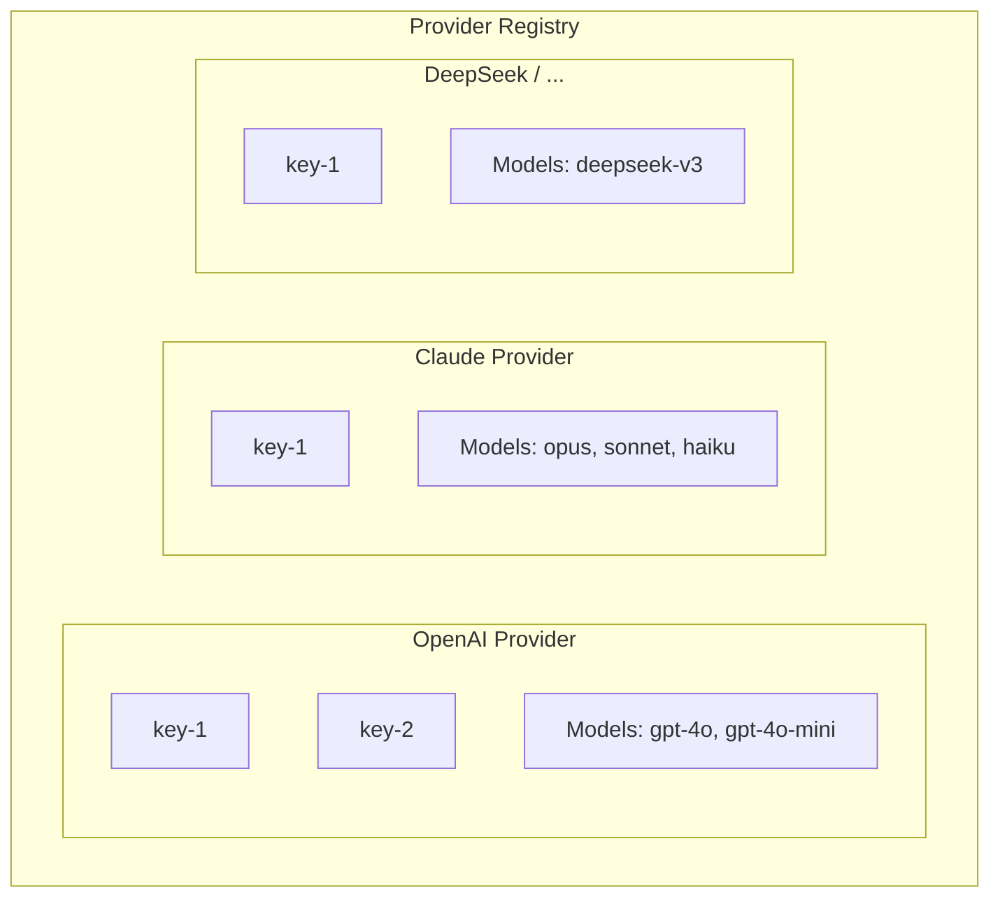
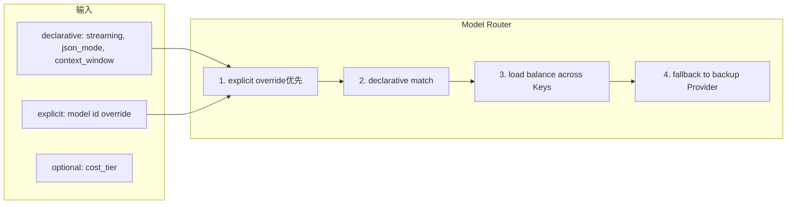
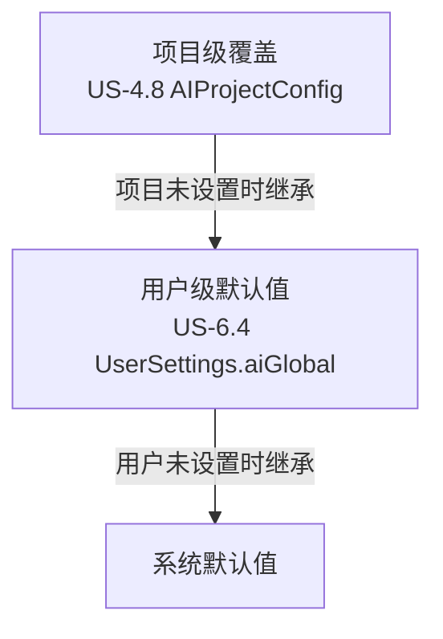
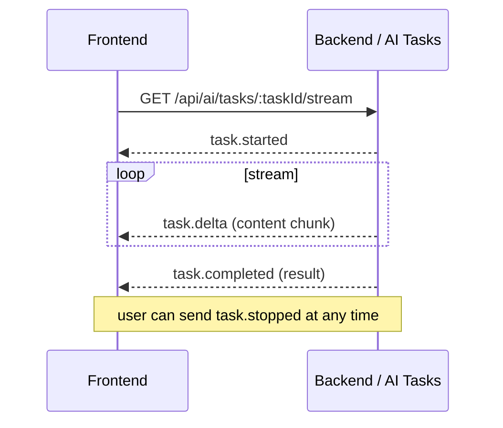
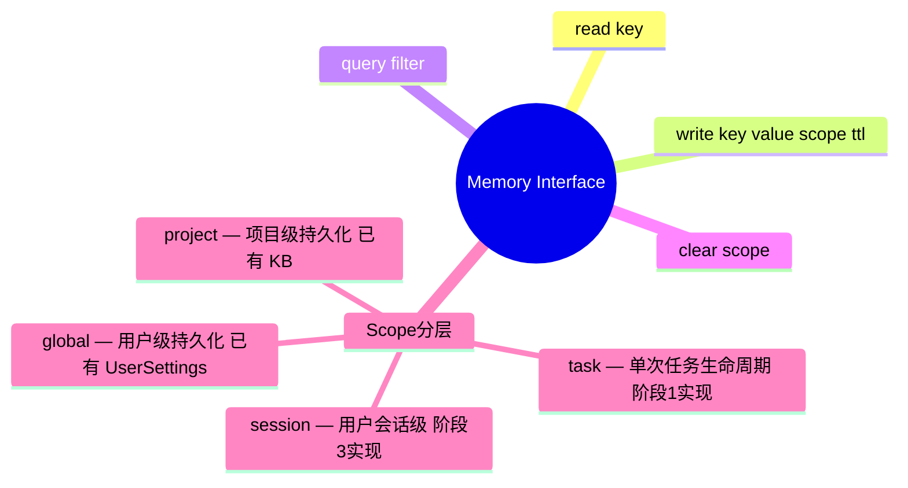
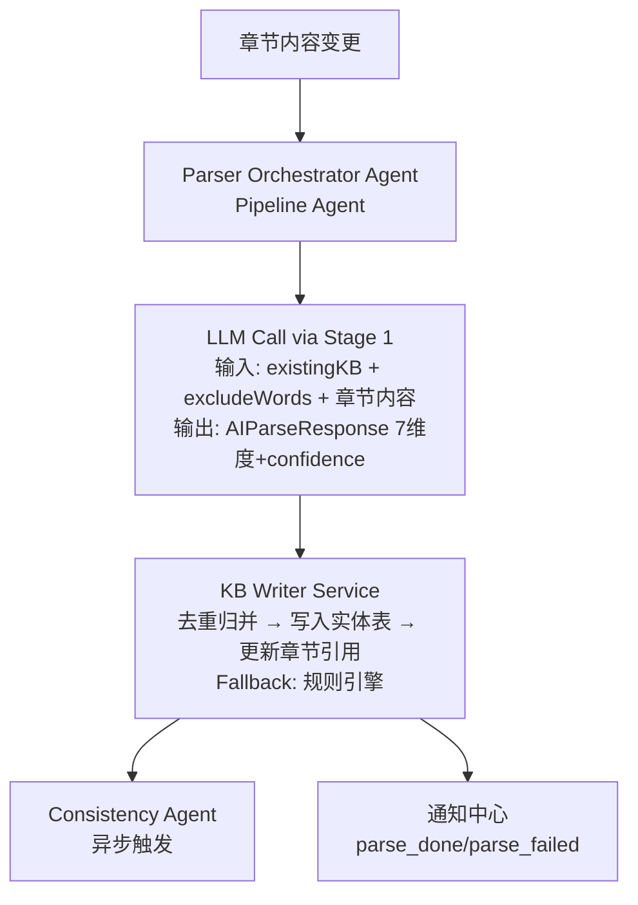
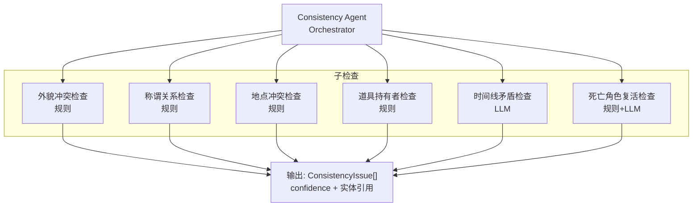
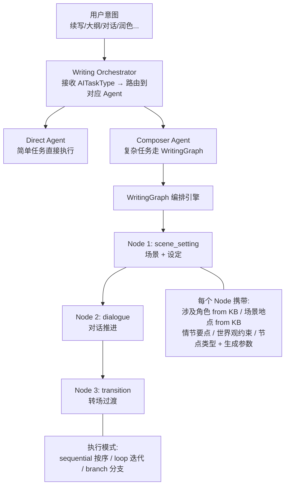

# bitsNovels · AI 系统架构设计

> 本文档定义 bitsNovels 的 AI 系统整体架构，覆盖 Multi-Agent 编排、Multi-Provider 基建、Memory 分层、以及 4 个阶段的实施路径。供 BE/FE Agent 实现时对齐。

---

## 1. 设计目标与核心意图

### 1.1 术语约定

本文档中：
- **Agent**：自主执行单元，可以接收任务、调用 LLM、产出结果。如 Parser Orchestrator Agent、Composer Agent。
- **Service**：被动能力提供者，为 Agent 或其他 Service 提供能力，自身不做决策。如 KB Writer Service、Memory Service。
- **Orchestrator**：编排者，把任务分发给 Agent 或 Service 并控制执行顺序。可以是 Agent（如 Composer Agent），也可以是纯代码逻辑。

### 1.2 核心意图

**意图 1：Multi-Agent 系统**
不是简单的"调 LLM API + 解析 JSON"，而是多个 Agent 协作完成任务。不同 AI 任务（解析、续写、润色、一致性检查等）由不同的 Agent 承担，Agent 之间通过消息队列通信和编排。

**意图 2：Multi-Provider 基建**
AI Provider 层不绑死单一模型，而是做成一个统一的 Provider 池。每个 API Key 作为一个可选资源，下游的 Agent/Service 可以自由选择用哪个 Provider + Model 来完成任务。

### 1.2 与已有契约的关系

| 契约来源 | 约束内容 |
|---------|---------|
| `specs/epic-2/contract.md` | `AIParseRequest/AIParseResponse` — 解析输入输出结构（FROZEN） |
| `specs/epic-4/contract.md` | `AITaskType`（9 种任务类型）、`AIProjectConfig`（项目级配置）、`AIResult`（统一结果容器）、上下文注入优先级（FROZEN） |
| `specs/epic-6/contract.md` | `UserSettings.aiGlobal` — 用户级 AI 默认值（FROZEN） |
| `design/BACKEND.md` | SSE 流式协议（started/delta/completed/failed/stopped）、ARQ 任务队列优先级、并发上限、超时重试规范 |

---

## 2. 阶段总览

| 阶段 | 核心交付 | 前置依赖 |
|------|---------|---------|
| **阶段 1** | AI 基础设施层（Provider 池 + Agent Runtime + Memory + 流式通道） | ARQ/Redis 基建完成 |
| **阶段 2** | Parser Agent 系统（解析引擎 + Consistency Agent + Fallback） | 阶段 1 完成 |
| **阶段 3** | AI 写作 Agent 系统（WritingGraph 节点编排 + Composer/Generator） | 阶段 1 完成 |
| **阶段 4** | 高级 AI 能力（向量检索 + 跨章节推理 + 长上下文摘要） | 阶段 2+3 完成 |

---

## 3. 阶段 1：AI 基础设施层

### 3.1 Multi-Provider Registry



> 这张图展示了 Provider Registry 的结构：每个 Provider（如 OpenAI/Claude/DeepSeek）可以注册多个 API Key，每个 Key 下挂载该 Provider 可用的 Model 列表。

**职责**：注册和管理所有可用的 AI Provider 及其 API Key。

**V1 系统级配置**：管理员在后台注册 Provider + Key + 可用 Model 列表。

**V2 BYOK 流程**：用户在设置页填入 API Key → 系统校验 Key 有效性 → 注册到 Provider Registry，标记为用户专属 → Model Router 在匹配时优先使用系统 Key，用户 Key 作为备选或直接覆盖。

**同 Provider 多 Key**：支持轮转负载均衡和限速分摊。当某个 Key 触发 rate limit 时，自动切换到下一个可用 Key。

### 3.2 Model Router



> 这张图说明了 Model Router 的匹配流程：先看是否有显式 model 覆盖 → 再按声明式能力标签匹配 → 然后在同 Model 的多 Key 之间轮转 → 最后如果 Provider 不可用则 fallback 到备选。

**输入参数定义**：
- `streaming` — 是否需要流式输出（`true` = 续写/对话场景，`false` = 大纲/起名场景）
- `json_mode` — 是否要求结构化 JSON 输出（如 AIParseResponse 的 7 维度 JSON）
- `context_window` — 所需的上下文窗口大小（如 `>= 128k` 适合长章节解析）
- `model` — 显式指定 model id（如 `gpt-4o`、`claude-sonnet`），覆盖声明式匹配
- `cost_tier` — 可选，成本档位：`economy` / `standard` / `premium`

**匹配规则**：
- 默认走声明式能力匹配（Agent 声明需要 streaming/json_mode/context_window，Router 自动匹配最优 Model）
- 允许显式覆盖（用户/项目配置直接指定 model id，如 `AIProjectConfig.model`）
- 与已有契约 `AIProjectConfig.model?: string` 天然兼容

### 3.3 AI Config Service

**三级覆盖解析器**：系统默认 → 用户级 → 项目级



> 这张图展示了三级配置覆盖的继承关系：项目级未设置的字段，继承用户的全局偏好；用户未设置的字段，继承系统默认值。

**规则**：
- `model`、`temperature`、`maxLength`、`parseDepth` 按**字段级继承**，不整对象覆盖
- 保存配置后，新任务立即读取新配置
- 运行中任务继续使用创建时快照（保证执行期间配置稳定）
- `parseDepth` 同时服务于 Parser（Epic 2）和写作（Epic 4），需要跨 Epic 共享

### 3.4 SSE Stream Manager

统一流式通道，支持所有需要流式输出的 AI 任务。

**事件协议**（对齐 `design/BACKEND.md` 规范）：



> 这张序列图说明了 SSE 流式输出的事件生命周期：前端订阅 → 后端 `started` → 逐字 `delta` 推送 → `completed` 结束。用户可随时发送 `stopped` 中止任务。

**职责**：
- 每个任务独立 SSE 订阅通道
- 支持任务级别的流式中断（用户按 Esc）
- 保证单次断连后能通过 `task.completed/failed/stopped` 事件优雅结束

### 3.5 Agent Runtime

**Agent 定义**：
- **Pipeline Agent**：任务步骤固定，由 Orchestrator 按固定顺序编排。大部分任务属于此类。
- **Autonomous Agent**：可以自主规划下一步行动，调用工具，请求其他 Agent 协作。少数复杂任务（如跨章节推理）使用。

**混合模式**：
- 解析、续写、润色等 → Pipeline Agent
- 一致性检查的深层推理 → Autonomous Agent（阶段 4 引入）

### 3.6 Message Bus

Agent 间通信基建，基于 Redis pub/sub 实现。

**两种模式**：
- **Point-to-Point**：一个 Agent 给另一个 Agent 发消息（如 Parser 完成后通知 Consistency Agent）
- **Broadcast**：一个 Agent 发布事件，多个 Agent 订阅（如"章节内容变更"事件）

**与已有 Task Queue 的关系**：
- Task Queue（ARQ）：负责**异步任务调度**，有优先级、并发控制、超时重试
- Message Bus：负责**Agent 间实时消息**，无持久化，轻量级
- 两者协作：Task Queue 负责"什么时候执行"，Message Bus 负责"执行过程中谁和谁通信"

### 3.7 Memory Service



> 这张思维导图展示了 Memory 接口的 4 个操作方法和 4 个 Scope 层级。阶段 1 只实现 task scope（Working Memory），其余 scope 按需延后。

**设计决策**：
- 阶段 1 只实现 **TaskScopedMemory**（基于 Redis TTL KV，任务完成后自动清理）
- 其他 scope 的实现留给后续阶段按需加
- Memory 接口定义好，让上层 Agent 面向接口编程

### 3.8 Task Queue

基于 ARQ + Redis 的异步任务队列。

| 参数 | 值 |
|------|---|
| 优先级 | 手动触发=10, 自动触发=5, 批量触发=1 |
| Parser 并发 | 最多 5 个并行 |
| AI 续写/润色 | 最多 3 个并行 |
| 文件导出 | 最多 2 个并行 |
| 单任务超时 | 60 秒 |
| 超时重试 | 自动重试 1 次 |
| 再失败 | 标记 failed，写入错误原因，通知前端 |

---

## 4. 阶段 2：Parser Agent 系统

### 4.1 架构概览



> 这张图说明了 Parser 的完整数据流：章节变更触发 → Orchestrator 组装请求 → 单次 LLM 大调用 → KB Writer 去重归并写入 → 完成后同时通知 Consistency Agent（异步检查）和通知中心。

**设计决策**：
- **单次大调用**：1 次 LLM 调用输出全部 7 维度（characters / locations / items / factions / foreshadows / relations / consistencyIssues）。成本最低，与冻结契约 `AIParseResponse` 天然对齐。
- **单 Agent 降级**：任何环节失败时，该环节走确定性规则 fallback，其他环节继续。结果标记 `fallback.used = true`。

### 4.2 Parser Orchestrator Agent

**输出维度**（`AIParseResponse` 的 7 个维度，定义在 `specs/epic-2/contract.md`）：
1. `characters` — 角色（名称/别名/性别/职业/外貌/性格标签/所属势力）
2. `locations` — 地点（名称/别名/类型/描述/上级地点）
3. `items` — 道具（名称/别名/类型/描述/持有者）
4. `factions` — 势力（名称/别名/类型/描述/成员/同盟/敌对）
5. `foreshadows` — 伏笔（名称/摘要/原文引用）
6. `relations` — 关系（来源角色/目标角色/关系类型/描述）
7. `consistencyIssues` — 一致性问题（类型/描述/置信度/关联实体）

**输入**（对齐 `AIParseRequest`）：
- `chapterId` + `projectId` + 章节内容
- `existingKB`：已有知识库条目（角色/地点/道具/势力/伏笔），用于去重归并
- `excludeWords`：排除词列表（用户标记"非角色"的词自动加入）

**流程**：
1. 从 Context Assembler 读取已有的 KB 条目
2. 构造 Prompt：章节内容 + existingKB + excludeWords + 输出格式约束（JSON Schema）
3. 调用 LLM（通过 Model Router 选配最优 Model）
4. 解析 `AIParseResponse`
5. 分发到各 KB Service 写入
6. 发送 `parse_done` 事件到 Message Bus → 触发 Consistency Agent

### 4.3 Consistency Agent

**独立于 Parser Pipeline**，通过异步事件触发。

**触发模式**：
- **异步自动触发**：Parser 完成后，通过 Message Bus 发送 `parse_done` 事件，Consistency Agent 订阅并执行
- **手动全量触发**：用户在知识库面板点击"检查一致性"，直接调用 Consistency Agent 对全书做检查

**内部架构 — 子检查可复用**：



> 这张图展示了 Consistency Agent 的内部架构：Orchestrator 分发 6 个独立子检查并行执行，每个检查独立失败不阻塞其他，最终汇总为 ConsistencyIssue 列表。

**子检查类型**（对齐 `ConsistencyIssueType`）：

| 子检查 | 检查内容 | 实现方式 | 可复用场景 |
|--------|---------|---------|-----------|
| `appearance_conflict` | 同一角色外貌描述前后矛盾 | 规则 + LLM 对比 | 角色详情页"对比设置" |
| `relation_conflict` | 称谓/关系前后不一致 | 规则 + LLM 对比 | 关系图谱编辑时校验 |
| `location_conflict` | 地点描述前后矛盾 | 规则 + LLM 对比 | 设定编辑时校验 |
| `item_owner_conflict` | 道具持有者逻辑冲突 | **纯规则** | 道具转手时实时校验 |
| `timeline_conflict` | 时间线矛盾 | LLM 推理 | 大纲生成时校验 |
| `dead_character_reappear` | 死亡/退场角色再出现 | **纯规则 + LLM** | Parser 识别角色出场时校验 |

**对齐契约**：
- 每条问题带 `confidence: high | medium | low`
- 状态流转：`open → fixed / ignored / intentional`
- 高置信度问题推送到通知中心（受 US-6.4 通知配置控制）

### 4.4 Fallback 机制

当 LLM 不可用或调用失败时：
1. **Parser fallback**：降级为确定性规则引擎（当前已有的规则解析），输出结构对齐 `AIParseResponse`，`confidence` 设为低
2. **Consistency fallback**：纯规则子检查正常执行，LLM 子检查跳过并标记 `fallback`
3. 结果中通过 `FallbackMeta` 标记：
   - `used: true`
   - `strategy: 'rule_based'`
   - `reason: 'upstream_unavailable' | 'upstream_timeout' | 'degraded_mode'`

---

## 5. 阶段 3：AI 写作 Agent 系统

### 5.1 架构概览 — WritingGraph 节点编排模型

写作的本质是"场景 → 人物 → 设定 → 情节"等元素的编排。不是 8 个独立功能按钮，而是基于**节点编排**的创作系统。



> 这张图说明了 WritingGraph 节点编排模型的完整流程：用户意图 → Writing Orchestrator 路由 → 简单任务走 Direct Agent（润色/起名/建议），复杂任务走 Composer Agent 生成 WritingGraph → 节点按序/循环/分支执行。

### 5.2 三类 Agent 角色

| Agent | 职责 | 什么时候用 |
|-------|------|-----------|
| **Composer Agent** | 分析写作意图 → 生成 WritingGraph（节点序列 + 依赖关系） | 大纲生成、长续写、复杂对话 |
| **Generator Agent** | 接收单个 WritingNode → 调用 LLM → 流式输出该节点文本 | 每个节点的实际 LLM 生成 |
| **Direct Agent** | 处理不需要编排的简单任务，直接输入→LLM→输出 | 润色、扩写、缩写、起名、建议 |

**任务路由规则**（对齐 `AITaskType`）：

| AITaskType | 路由 | 说明 |
|-----------|------|------|
| `continue` | Composer → WritingGraph → Generator | 长续写可拆成多节点 |
| `dialogue` | Composer → WritingGraph → Generator | 多角色对话适合多轮节点 |
| `outline` | Composer → WritingGraph | 本质是生成方向卡片 |
| `polish` | Direct Agent | 选区文本 + Prompt → Diff |
| `expand` | Direct Agent | 选区文本 + 倍数控制 → Diff |
| `summarize` | Direct Agent | 选区文本 + 压缩比例 → Diff |
| `name_gen` | Direct Agent | 参数化结构化输出 |
| `advice` | Direct Agent | 四维度建议列表 |

### 5.3 WritingNode 数据模型

```typescript
interface WritingNode {
  id: string
  type: 'scene_setting' | 'character_entry' | 'dialogue' | 'action'
      | 'inner_thought' | 'transition' | 'plot_point'

  // 编排内容（来自 KB 的数据引用）
  involvedCharacters: string[]    // KB 角色 ID
  location?: string               // KB 地点 ID
  plotPoints: string[]            // 情节要点（自然语言）
  worldConstraints: string[]      // 世界观约束（from KB Setting）
  foreshadowRefs?: string[]       // 相关伏笔 ID

  // 生成参数
  targetLength?: number
  tone?: string                   // 语气/风格

  // 执行状态
  status: 'pending' | 'generating' | 'done' | 'rejected' | 'skipped'
  output?: string

  // 编排关系
  dependsOn?: string[]            // 依赖的前序节点
  order: number
}

interface WritingGraph {
  id: string
  taskId: string                  // 关联 AI Task
  chapterId: string
  nodes: WritingNode[]
  executionMode: 'sequential' | 'loop' | 'branch'
  currentNodeIndex: number
  status: 'planning' | 'executing' | 'paused' | 'completed'
}
```

### 5.4 Context Assembler

组装每次 LLM 调用的上下文，执行 Token 裁剪。

**位置**：V1 内嵌在 Writing Orchestrator 中（服务模块），等向量检索（阶段 4）接入后按需拆出为独立 Agent。

**Token 裁剪优先级**（对齐 `specs/epic-4/contract.md` 冻结规则）：
1. 系统指令 + 任务指令 + 项目级生效配置（永远保留，必须 `required`）
2. 当前章节全文（最后裁剪，优先保留光标附近段落的原文）
3. 知识库条目 + 世界观设定（按相关度排序后裁剪）
4. 前一章末尾 2000 字（最低优先级，可先缩短后移除）

**裁剪算法**：
1. 收集原始上下文块，每块打上 `source`、`priority`、`estimatedTokens`、`required`
2. 先加入 `required` 块：系统指令、任务指令、配置块
3. 加入当前章节全文
4. 按相关度依次加入知识库条目与世界观块，直到接近预算上限
5. 最后尝试加入前一章末尾；如果超限，逐步缩短尾段长度
6. 若当前章节全文已逼近上限，保留靠近光标的段落原文，较远段落做摘要化压缩（阶段 4 Long Context Summarizer）

### 5.5 AI Result 统一容器

所有 Agent 的输出归一化到 `AIResult`（定义在 `specs/epic-4/contract.md`）。

```typescript
interface AIDiffChange {
  type: 'insert' | 'delete'
  content: string
}

interface AIResult {
  taskId: string
  type: AITaskType
  status: 'generating' | 'done' | 'stopped' | 'failed'
  content?: string          // 续写/对话的自由文本
  diff?: AIDiffChange[]     // 润色/扩写/缩写的 Diff 结果
  suggestions?: string[]    // 大纲建议列表
  names?: string[]          // 起名候选列表
  error?: string            // 失败原因
  createdAt: string
}
```

**状态语义**：
- `generating`：流式任务仍在生成中
- `done`：生成成功，结果可被采纳
- `stopped`：用户主动中止，保留已生成的部分结果
- `failed`：任务失败，附带 `error` 字段

### 5.6 与已有契约的映射

| 契约字段 | 定义位置 | 在写作 Agent 系统中的位置 |
|---------|---------|------------------------|
| `AITaskType` | `specs/epic-4/contract.md` | Writing Orchestrator 路由依据（见 5.2） |
| `AIProjectConfig` | `specs/epic-4/contract.md` | Context Assembler 配置输入（见 5.4） |
| `AIResult` | 上文 5.5 定义 | 所有 Agent 输出归一化结构 |
| `AIResult.status` | 上文 5.5 | SSE 事件 payload 状态字段 |
| `AIResult.diff: AIDiffChange[]` | 上文 5.5 | Direct Agent 输出 |
| `AIResult.content: string` | 上文 5.5 | Generator Agent 输出 |
| `AIResult.suggestions: string[]` | 上文 5.5 | Composer Agent 输出 |
| `AIResult.names: string[]` | 上文 5.5 | Direct Agent 输出 |

---

## 6. 阶段 4：高级 AI 能力

### 6.1 KB Vector Service

**职责**：知识库实体向量化 + 按相关度检索

**输入**：当前章节内容 + KB 实体
**输出**：按相关度排序的 KB 条目列表（供 Context Assembler 注入）

**实现**：
- pgvector（PostgreSQL 扩展，同库同实例）
- HNSW 索引，V1 百万级向量足够
- 替代当前"按章节已关联实体"的静态关联方式

**依赖**：阶段 2 KB 实体数据已就绪

### 6.2 Deep Consistency Agent

升级版一致性检查，需要跨章节的语义理解。

**核心场景**：
- `timeline_check`：推理多章时间线是否矛盾（"第一章说春天" vs "第三章说冬天"但只有一个月后）
- `death_exit_check`：确认角色是否真的死亡/退场（可能需要多章上下文判断）

**挑战**：不能把全书塞入上下文窗口。解决方案：
- 先用摘要链（章节 → 卷级摘要 → 全书摘要）压缩上下文
- 再把"可疑章节"的原文作为对比证据注入

### 6.3 Foreshadow Recovery Agent

伏笔疑似回收内容的语义匹配。

**当前状态**：阶段 2 的 Parser 可以识别新伏笔，但"疑似回收"匹配需要跨章节语义理解。

**实现方向**：
- 向量化已识别的伏笔（埋设章节 + 原文引用）
- 每次新章节解析时，向量化当前章节并检索最相似的未回收伏笔
- LLM 判断"这段内容是否呼应了伏笔"
- 输出为 `KBForeshadowSuggestion`，等待用户确认

### 6.4 Long Context Summarizer

当章节全文超出 Token 预算时，保留光标附近原文，远处段落摘要化压缩。

**应用场景**：Context Assembler 裁剪第 6 步的补充手段。

**实现方向**：
- 短文本（< 3000 字）→ 不压缩
- 中等文本（3000-8000 字）→ 光标附近 2000 字保留原文 + 远处段落做 2 句摘要
- 长文本（> 8000 字）→ 光标附近 1500 字 + 光标前/后各 500 字 + 其余摘要化

---

## 7. 已确认的设计决策汇总

| # | 决策项 | 结论 | 讨论来源 |
|---|--------|------|---------|
| 1 | Key 管理模式 | 两者都支持（V1 系统级，后续加 BYOK） | 阶段 1 |
| 2 | Model 选择策略 | 声明式能力匹配 + 显式覆盖结合 | 阶段 1 |
| 3 | 多 Key 用途 | 同 Provider 多 Key 做负载均衡/限速分摊 | 阶段 1 |
| 4 | Agent 粒度 | 混合模式（大部分 Pipeline + 少数自主 Agent） | 阶段 1 |
| 5 | Agent 通信 | 消息传递（基于 Redis 消息队列） | 阶段 1 |
| 6 | Memory 分层 | 阶段 1 做接口定义 + TaskScopedMemory；其他 scope 延后 | 阶段 1 |
| 7 | Parser LLM 调用拓扑 | 单次大调用出全部 7 维度 | 阶段 2 |
| 8 | Agent 失败策略 | 单 Agent 降级到确定性规则 fallback，不阻塞全局 | 阶段 2 |
| 9 | 一致性检查归属 | 独立 Consistency Agent，异步自动触发 + 手动全量触发双模式 | 阶段 2 |
| 10 | 一致性子检查 | 6 个独立子检查（规则/LLM 混合），可独立复用 | 阶段 2 |
| 11 | 写作 Agent 架构 | WritingGraph 节点编排 + Composer/Generator/Direct 三角色 | 阶段 3 |
| 12 | Context Assembler 定位 | V1 内嵌在 Orchestrator 中，后续按需独立 | 阶段 3 |

---

## 8. 与已有系统的集成点

| 现有系统 | AI 系统如何集成 | 负责阶段 |
|---------|---------------|---------|
| Parser Service (`server/services/parser_service.py`) | 阶段 2 用 AI Parser 替换当前确定性规则，保留为 Fallback | 阶段 2 |
| KB Services（character/location/item/faction/foreshadow） | Parser Agent 写入各 KB 实体表 | 阶段 2 |
| Notification Service（US-6.6） | 解析完成/失败/一致性问题自动推送到通知中心 | 阶段 2 |
| Editor（US-3.1） | 续写/润色/对话在编辑器内触发，SSE 流式输出 | 阶段 3 |
| Project Settings（US-4.8） | AI 配置面板（项目级 model/temperature/maxLength/parseDepth） | 阶段 3 |
| User Settings（US-6.4） | AI 全局默认值配置 | 阶段 1 |
| ARQ Task Queue | 所有 AI 任务的异步调度和优先级管理 | 阶段 1 |

---

## 9. 下一步

### 立即可做（阶段 1 启动前）

- [ ] 设计 Provider Registry 的数据模型（Provider / APIKey / Model 表结构）
- [ ] 确定 V1 先支持哪些 Provider（OpenAI / Claude / DeepSeek / 国产模型）
- [ ] 定义 Agent 的注册协议（Agent 接口规范：`execute(task) → AgentResult`）
- [ ] 设计 Message Bus 的 Redis Channel 命名规范

### 阶段 1 → 阶段 2 的桥梁

- [ ] 实现 Parser Orchestrator 的 Prompt 模板（基于 AIParseRequest/AIParseResponse）
- [ ] 设计 Consistency Agent 的子检查注册机制
- [ ] 为现有 Parser 服务编写 Fallback 模式测试

### 阶段 2 → 阶段 3 的桥梁

- [ ] 设计 WritingGraph 的持久化方案（是否存到数据库，还是纯内存状态）
- [ ] 定义 Composer Agent 的 Prompt 模板（从 KB → WritingGraph 的转化）
- [ ] 设计 Generator Agent 和 Context Assembler 的协作协议

### 阶段 3 → 阶段 4 的桥梁

- [ ] pgvector 接入 KB 实体表的 schema 设计
- [ ] Embedding model 的选型（OpenAI text-embedding-3 / 本地模型）
- [ ] Long Context Summarizer 的分段策略和质量评估标准

---

## 10. 附录

### 10.1 US 速查表

| US | 名称 | 一句话说明 |
|-----|------|-----------|
| US-2.1 | Parser 解析触发 | 章节内容 → LLM 解析 → 提取结构化知识（7 维度） |
| US-2.2 | 角色识别与管理 | NER 识别角色 + 去重归并 + 批量确认 |
| US-2.3 | 地点识别与管理 | NER 识别地点 + 树形层级 + 父子关系 |
| US-2.4 | 道具/物品识别 | NER 识别道具 + 持有者变更历史追踪 |
| US-2.5 | 势力/组织识别 | NER 识别势力 + 成员归属 + 同盟/敌对 |
| US-2.6 | 伏笔追踪 | 伏笔识别 + 疑似回收匹配 + 提醒机制 |
| US-2.7 | 关系图谱 | 角色间关系识别 + 图谱节点/边生成 |
| US-2.8 | 一致性检查 | 跨章节矛盾检测 + 置信度 + 处理状态 |
| US-4.1 | AI 续写 | 流式生成 + 上下文注入 + Esc 停止 |
| US-4.2 | AI 润色 | 选区改写 + Diff 输出 + 可撤销 |
| US-4.3 | AI 扩写/缩写 | 选区倍数控制 + Diff 输出 |
| US-4.4 | AI 对话生成 | 角色画像注入 + 流式对话输出 |
| US-4.5 | AI 大纲建议 | 结构化方向卡片（2-3 个建议） |
| US-4.6 | AI 起名 | 10 个候选名字 + 文化/性别约束 |
| US-4.7 | AI 写作建议 | 四维度（节奏/人物/描写/情节）建议 |
| US-4.8 | 项目 AI 配置 | 三级覆盖（项目 > 用户 > 系统）配置管理 |
| US-6.4 | 通知配置 | 用户级 AI 默认值 + 通知渠道开关 |

### 10.2 术语表

| 术语 | 含义 |
|------|------|
| **Agent** | 自主执行单元，可接收任务、调用 LLM、产出结果 |
| **Service** | 被动能力提供者，为 Agent 提供能力，不做决策 |
| **Orchestrator** | 编排者，控制任务分发和执行顺序 |
| **KB / Knowledge Base** | 知识库，存储角色/地点/道具/势力/伏笔/世界观等结构化知识 |
| **Worldview / 世界观设定** | 修炼体系、货币体系等世界的底层规则 |
| **Parser** | 解析引擎，将章节正文转为结构化知识库数据 |
| **WritingGraph** | 写作任务的节点编排图，由 WritingNode 组成 |
| **Context Assembler** | 上下文组装器，负责 Token 预算管理和裁剪 |
| **SSE** | Server-Sent Events，服务端推送流式数据的协议 |
| **ARQ** | Python 异步任务队列，基于 Redis |
| **BYOK** | Bring Your Own Key，用户自带 API Key |
| **FROZEN** | 契约冻结标记，表示该定义不可随意变更 |
| **parseDepth** | 解析深度，可选值 `fast` / `standard` / `deep`，同时服务 Parser 和写作 |
| **Fallback** | 降级策略，当 AI 不可用时退回到确定性规则引擎 |
| **AIParseRequest** | Parser 的 LLM 输入结构，包含章节内容 + existingKB + excludeWords |
| **AIParseResponse** | Parser 的 LLM 输出结构，包含 7 个维度 + confidence |
| **AITaskType** | AI 任务类型枚举（9 种），统一任务路由 |
| **AIProjectConfig** | 项目级 AI 配置，字段级覆盖系统/用户默认值 |
| **AIResult** | 统一 AI 结果容器，兼容流式/Diff/结构化输出 |
| **ConsistencyIssue** | 一致性检查结果，包含类型/描述/置信度/处理状态 |
| **KBForeshadowSuggestion** | 伏笔疑似回收建议，由 AI 生成等待用户确认 |
