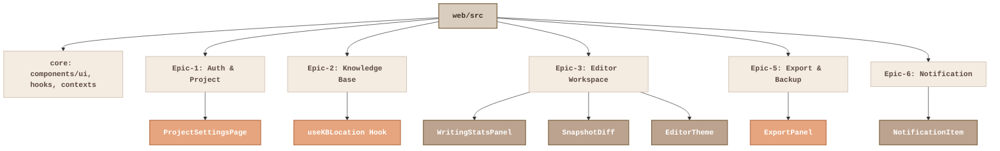

# 前端重构 Impact Analysis 报告

## 1. 架构评估与依赖分析

根据 `general_purpose_task` 与 `ui-zen-master` 的联合评估，当前 `workspace/apps/web/src` 存在以下核心问题：
1. **API 层碎片化**：各个组件直接使用 fetch，缺乏统一的请求上下文（TanStack Query 是 Phase E 目标，目前需先收敛）。
2. **状态深渊 (Fat Components)**：部分组件内部耦合了数十个 Hook 调用（如 `ExportPanel`、`ProjectSettingsPage`）。
3. **视觉异端 (Token 断层)**：存在大量硬编码色值和内联样式（如 `WritingStatsPanel`、`SnapshotDiff`）。
4. **路由层全量加载**：缺少 Code Splitting 和统一的 Shell 布局。

### 依赖关系树 (Dependency Tree)
```text
[App.tsx] (路由层，当前全量同步加载)
 ├── [contexts/AuthContext] (全局 Auth 状态)
 ├── [features/epic-1] (用户鉴权与项目管理)
 │    └── 依赖: components/ui/*, api/client
 ├── [features/epic-2] (知识库系统)
 │    └── 依赖: hooks/useKBCharacter 等
 ├── [features/epic-3] (核心编辑器与统计)
 │    └── 依赖: @tiptap/react, hooks/useAutoSave
 ├── [features/epic-5] (备份与导入导出)
 ├── [features/epic-6] (通知系统)
 ├── [components/ui] (基础组件库，目前极度匮乏)
 └── [api/client.ts] (数据通信层，基于 openapi-fetch)
```

## 2. 可视化架构图与 Hot Spots (由界面神匠生成)



## 3. 测试用例影响范围 (Test Impact Matrix)

| 目标组件 / 模块 | 影响范围 | 关联测试用例 | 回归测试重点 |
| :--- | :--- | :--- | :--- |
| `ExportPanel` | 状态机重构，视图解耦 | `ExportPanel.test.tsx` | 格式选择、进度追踪、API轮询 |
| `ProjectSettingsPage` | 状态收敛 (`useReducer`) | `ProjectSettingsPage.test.tsx` | 表单提交、验证、数据同步 |
| `useKBLocation` | Hook 逻辑解耦 | `useKBLocation.test.ts` | 知识库实体 CRUD、状态变更 |
| `WritingStatsPanel` | Token 收敛，消除硬编码 | `WritingStatsPanel.test.tsx` | 统计数值渲染、主题切换响应 |
| `EditorTheme` | Tailwind 原子类规范化 | Visual Regression (Playwright) | 字体间距、对比度、Dark Mode |
| `App.tsx` (路由层) | 工作台 Shell 引入、懒加载 | `App.test.tsx`, e2e 核心链路 | 全局导航可达性、路由守卫 |

> 注：每次重构至少保证 `npm run test:web`（覆盖率 ≥ 73%）以及 `npm run -w @bitsnovels/web lint`、`npm run -w @bitsnovels/web typecheck` 通过；如补跑 `workspace` 根级 `npm run check`，脚本会自动自举 `.venv` 并补齐 Python `.[dev]` 依赖，确保根级 `ruff` 校验可在本地与 CI 一致执行。当前 Playwright E2E 已通过，但人工视觉走查仍存在待补风险。
